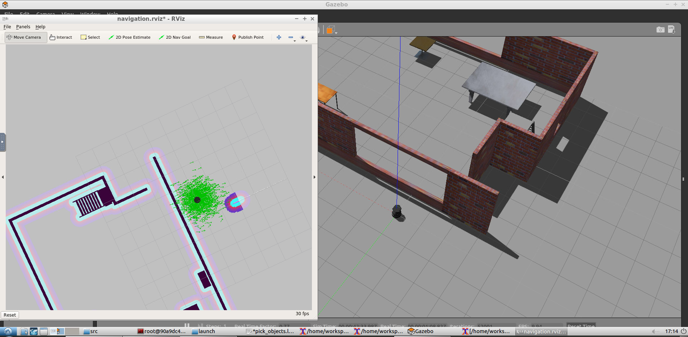

# Udacity-HomeServiceBot
*Udacity's Robotics Software Engineer last project.*

## Localization and Navigation:

### References:
> Ross Wiki:
>> http://wiki.ros.org/catkin/CMakeLists.txt
#### Udacity peers and git hub repos:
> Reference list:
>> cosa2: https://github.com/csosa27/RoboND-HomeServiceBot
>> udacity: https://github.com/udacity/RoboND-simple_arm
