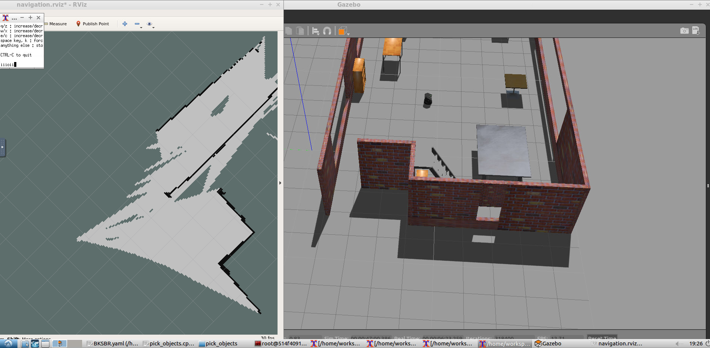
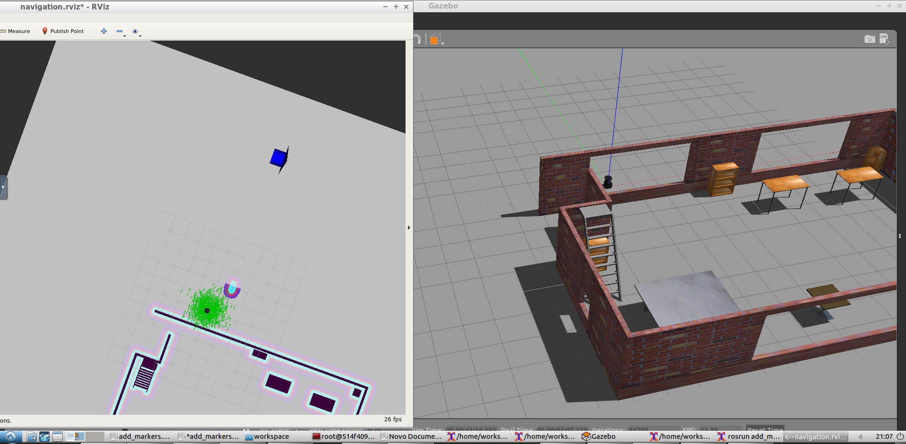

# Udacity-HomeServiceBot
*Udacity's Robotics Software Engineer last project.*

## Slam test:

## Localization and Navigation:

## Pick Objects

## Add Markers

### References:
> Ross Wiki:
>> #### http://wiki.ros.org/catkin/CMakeLists.txt
>> #### http://wiki.ros.org/rviz/Tutorials/Markers%3A%20Basic%20Shapes
#### Udacity and peer repos: 
> Reference list:
>> #### udacity(https://github.com/udacity/RoboND-simple_arm) 
>> #### cosa2(https://github.com/csosa27/RoboND-HomeServiceBot)
>> #### dhavenm(https://github.com/dehavenm/Udacity-Home-Service-Robot/tree/master/catkin_ws/src)
