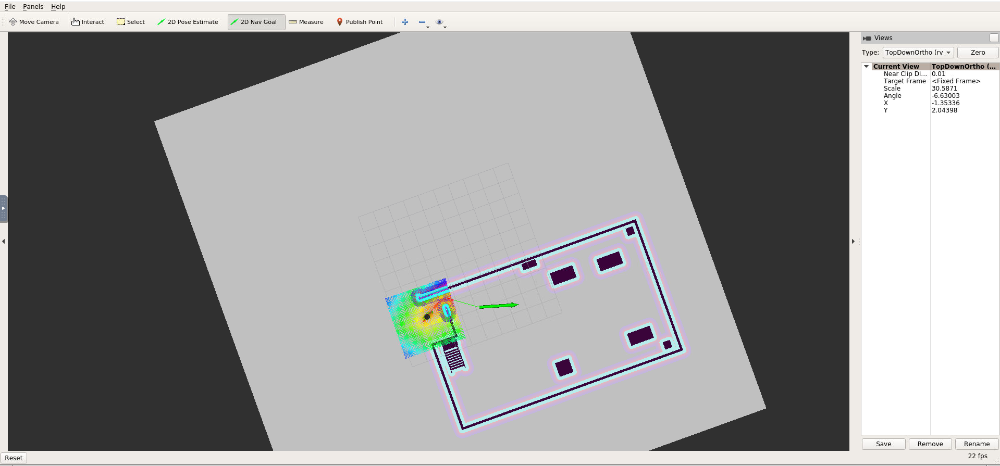

# Udacity-HomeServiceBot
*Udacity's Robotics Software Engineer last project.*

### Bomb disposal home bot:

The objective: this project is the exemplification of some the concepts learned throughout the course "Robotics Software Engineer", these concepts involve, localization, mapping and navigation.

##### How to:
  *First create you catkin_ws, src and init the catkin workspace*
  
  ##### Resources:
  > Clone this repo and paste all the content from "src" inside your own catkin_ws/src
  >> https://github.com/BlackKnightBR/Udacity-HomeServiceBot.git
  
  > ### Also clone inside src:
  >>  https://github.com/turtlebot/turtlebot_interactions.git 
 
##### Execution:
 > Do "catkin_make" at catkin_ws and source devel/setup.bash
 > #### Navigate to the scripts folder inside src, give exe permission to home_service.sh
 >>> chmod +x home_service.sh
 >>>> *./home_service.sh*
 >>>>> Watch the little bot retriev a bomb and take it to a safe zone outside the house.
 *Important: don't forget to "add"->"markers" inside rviz*

## Slam test:

### Autonomously map the environment you designed earlier with the Building Editor in Gazebo. But before you tackle autonomous mapping, it’s important to test if you are able to manually perform SLAM by teleoperating your robot. The goal of this step is to manually test SLAM.

## Localization and Navigation:

### We will be using the ROS Navigation stack, which is based on the Dijkstra's, a variant of the Uniform Cost Search algorithm, to plan our robot trajectory from start to goal position. The ROS navigation stack permits your robot to avoid any obstacle on its path by re-planning a new trajectory once your robot encounters them. You are familiar with this navigation stack from the localization project where you interfaced with it and sent a specific goal for your robot to reach while localizing itself with AMCL

## Pick Objects

###  The ROS navigation stack creates a path for your robot based on Dijkstra's algorithm, a variant of the Uniform Cost Search algorithm, while avoiding obstacles on its path.

## Add Markers

### The virtual object is the one being picked and delivered by the robot, thus it should first appear in its pickup zone, and then in its drop off zone once the robot reaches it.

## Bomb disposal bot!
> Initially show the marker at the pickup zone

> Hide the marker once your robot reaches the pickup zone

> Show the marker at the drop off zone once your robot reaches it

### References:
> Ross Wiki:
>> #### http://wiki.ros.org/catkin/CMakeLists.txt
>> #### http://wiki.ros.org/rviz/Tutorials/Markers%3A%20Basic%20Shapes
#### Udacity and peer repos: 
> Reference list:
>> #### udacity(https://github.com/udacity/RoboND-simple_arm) 
>> #### cosa2(https://github.com/csosa27/RoboND-HomeServiceBot)
>> #### dhavenm(https://github.com/dehavenm/Udacity-Home-Service-Robot/tree/master/catkin_ws/src)
